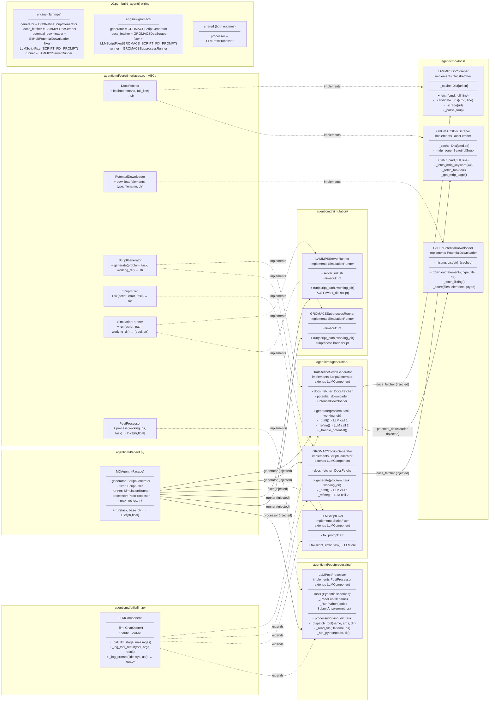

# AgenticMD Architecture

## Diagram 1 — Runtime Pipeline Flow

```mermaid
flowchart TD
    %% ── Entry Point ──────────────────────────────────────────────────────────
    subgraph entry["v0.py  ·  Entry Point"]
        CLI["CLI  argparse\n--tasks path/to/tasks.json\n--engine lammps | gromacs\n--workspace workspace/\n--logs logs/latest/"]
        TASKS["load_tasks(path)\nTaskSpec: id, problem_description, metrics"]
        LLM["ChatOpenAI  gpt-4o  temp=0"]
        FACTORY["build_agent(engine, llm, logger)\nDependency Injection Factory"]
        CLI --> TASKS & LLM & FACTORY
    end

    TASKS -->|"for each task"| AGENT

    %% ── MDAgent Facade ───────────────────────────────────────────────────────
    subgraph AGENT["MDAgent  ·  Facade  ·  agenticmd/agent.py"]
        direction TB
        AG1["generate(problem, task, working_dir)\nworking_dir = workspace/{task_id}/"]
        AG2{"attempt ≤ max_retries (3)?"}
        AG3["runner.run(script_attempt{n}.in, working_dir)"]
        AG4{"returncode == 0?"}
        AG5["fixer.fix(script, error, task)"]
        AG6["processor.process(working_dir, task)"]
        AG7["write  final_answer.json"]
        AG1 --> AG2
        AG2 -->|yes| AG3
        AG3 --> AG4
        AG4 -->|yes| AG6
        AG4 -->|no, attempt < max| AG5
        AG5 -->|corrected script| AG2
        AG2 -->|all attempts failed| AG6
        AG6 --> AG7
    end

    FACTORY --> AGENT

    %% ── Generation ───────────────────────────────────────────────────────────
    subgraph GEN["Script Generation  ·  agenticmd/generation/"]
        direction TB

        subgraph LGEN["DraftRefineScriptGenerator  (LAMMPS)"]
            L1["① _draft(problem, task)\nLLM Call 1  ·  DRAFT_SCRIPT_PROMPT\nWrite script from own knowledge\nNo read_data, plausible potential filename"]
            L2["② _parse_commands(draft)\n→ Dict token → first_full_line\ne.g. pair_style → 'pair_style lj/cut 2.5'"]
            L3["③ docs_fetcher.fetch(cmd, full_line)\nfor every unique command"]
            L4["④ _handle_potential(draft, working_dir)\ndetect file-based pair_style\n→ PotentialDownloader.download()"]
            L5["⑤ _refine(draft, docs, problem, task)\nLLM Call 2  ·  REFINE_SCRIPT_PROMPT\nFix syntax using docs only"]
            L1 --> L2 --> L3 --> L4 --> L5
        end

        subgraph GGEN["GROMACSScriptGenerator  (GROMACS)"]
            GG1["① _draft(problem, task)\nLLM Call 1  ·  GROMACS_DRAFT_PROMPT\nGenerate bash script with heredoc .mdp"]
            GG2["② _parse_mdp_keywords(draft)\nfrom inside 'cat > *.mdp << EOF' blocks\nkey = left of '=', skip ';' comments"]
            GG3["   _parse_gmx_commands(draft)\nfrom lines starting with 'gmx'\ne.g. grompp, mdrun, solvate"]
            GG4["③ docs_fetcher.fetch() for each\nMDP keywords + gmx tools"]
            GG5["④ _refine(draft, docs, problem, task)\nLLM Call 2  ·  GROMACS_REFINE_PROMPT"]
            GG1 --> GG2 --> GG4
            GG1 --> GG3 --> GG4
            GG4 --> GG5
        end
    end

    AG1 --> GEN

    %% ── Documentation Scrapers ───────────────────────────────────────────────
    subgraph DOCS["Documentation Retrieval  ·  agenticmd/docs/"]
        direction TB

        subgraph LSCRAPE["LAMMPSDocScraper"]
            LD1["_candidate_urls(cmd, full_line)\nStyle-aware URL resolution:\npair_style lj/cut → pair_lj_cut.html\nfix nvt/npt/nph  → fix_nh.html\ncompute pe/atom  → compute_pe_atom.html"]
            LD2["_scrape(url)\nrequests.get + BeautifulSoup\nfallback: if 404 try base command page"]
            LD3["_parse(soup)\n① SYNTAX — pre/code blocks\n② DOCUMENTATION — main text, max 3000 chars\n③ RESTRICTIONS — section#restrictions"]
            LD4[("in-memory cache\n{url → content}")]
            LD1 --> LD2 --> LD3
            LD2 <--> LD4
        end

        subgraph GSCRAPE["GROMACSDocScraper"]
            GD1{"full_line starts\nwith 'gmx'?"}
            GD2["_fetch_mdp_keyword(keyword)\nfind dt id='mdp-{keyword}'\nin cached MDP page\nextract following dd tag"]
            GD3["_fetch_tool(tool)\nGET onlinehelp/gmx-{tool}.html\nextract SYNOPSIS + DOCUMENTATION"]
            GD4[("_mdp_soup\nmdp-options.html\nlazy-loaded once")]
            GD5[("in-memory cache\n{command → content}")]
            GD1 -->|MDP keyword| GD2
            GD1 -->|gmx tool| GD3
            GD2 <--> GD4
            GD2 & GD3 <--> GD5
        end

        subgraph PDWN["GitHubPotentialDownloader"]
            PD1["_fetch_listing()\nGET api.github.com/.../potentials\ncached after first call"]
            PD2["_score(files, elements, ptype)\n+2 per element match in filename\n+1 if potential type in filename\nsort descending"]
            PD3["requests.get raw URL\nsave to working_dir/{filename}"]
            PD1 --> PD2 --> PD3
        end
    end

    L3 --> LSCRAPE
    GG4 --> GSCRAPE
    L4 --> PDWN

    %% ── Runners ──────────────────────────────────────────────────────────────
    subgraph RUN["Simulation Runners  ·  agenticmd/simulation/"]
        direction LR
        subgraph LRUN["LAMMPSServerRunner"]
            LR1["POST http://127.0.0.1:8000/run_lammps\n{work_dir: abs_path, script: filename}"]
            LR2{"HTTP 200 &\nreturncode==0?"}
            LR1 --> LR2
        end
        subgraph GRUN["GROMACSSubprocessRunner"]
            GR1["subprocess.run\n['bash', abs_script_path]\ncwd=working_dir, timeout=600s"]
            GR2{"returncode==0?"}
            GR1 --> GR2
        end
    end

    AG3 --> RUN

    %% ── Fixer ────────────────────────────────────────────────────────────────
    subgraph FIX["LLMScriptFixer  ·  agenticmd/generation/fixer.py"]
        FX1["_call_llm('Fix', messages)\nfix_prompt (LAMMPS or GROMACS variant)\nscript + error → corrected script"]
    end

    AG5 --> FIX

    %% ── Post-Processor ───────────────────────────────────────────────────────
    subgraph POST["LLMPostProcessor  ·  agenticmd/postprocessing/processor.py"]
        direction TB
        PP0["bind_tools([_ReadFile, _RunPython, _SubmitAnswer])\nat init time"]
        PP1["build messages:\nSystemMessage(POST_PROCESSING_PROMPT)\nHumanMessage(task + metrics + ls working_dir)"]
        PP2["_call_llm(PostProcess-turn{n}, messages)\nmax 10 turns"]
        PP3{"tool_calls\nin response?"}
        PP4["_ReadFile(filename)\nread file from working_dir\ntruncate at 12 000 chars"]
        PP5["_RunPython(code)\nsubprocess python -c code\ncwd=working_dir, timeout=60s\nnumpy + pandas available"]
        PP6["_SubmitAnswer(metrics)\nDict[str, float]"]
        PP7{"metrics\nnon-empty?"}
        PP8["append error ToolMessage\n'Re-read files and retry'"]
        PP9["return metrics\nDict[str, float]"]
        PP10["attempt JSON parse\nof response.content"]
        PP0 --> PP1 --> PP2 --> PP3
        PP3 -->|_ReadFile| PP4 -->|ToolMessage result| PP2
        PP3 -->|_RunPython| PP5 -->|ToolMessage result| PP2
        PP3 -->|_SubmitAnswer| PP6 --> PP7
        PP7 -->|empty| PP8 -->|retry| PP2
        PP7 -->|ok| PP9
        PP3 -->|no tool calls| PP10
    end

    AG6 --> POST

    %% ── LLMComponent Base ────────────────────────────────────────────────────
    subgraph BASE["LLMComponent  ·  agenticmd/utils/llm.py  (Base Mixin)"]
        B1["_call_llm(stage, messages)\n──────────────────────────\nlog  ══ [stage] PROMPT ══\nfor each msg: log role + content\ninvoke self.llm\nlog  ══ [stage] RESPONSE (Xs) ══\nlog content + tool_calls\n──────────────────────────\nreturn AIMessage"]
        B2["_log_tool_result(tool_name, args, result)\nlog  ← TOOL RESULT [name]: result[:500]"]
    end

    GEN & FIX & POST -.->|inherits| BASE

    %% ── External Services ────────────────────────────────────────────────────
    subgraph EXT["External Services"]
        E1["docs.lammps.org\n/{command}.html\n/pair_{style}.html\n/fix_nh.html  (nvt/npt/nph)\n/compute_{style}.html"]
        E2["manual.gromacs.org/current\n/user-guide/mdp-options.html\n/onlinehelp/gmx-{tool}.html"]
        E3["api.github.com\n/repos/lammps/lammps/contents/potentials\n→ JSON listing of 260+ files"]
        E4["raw.githubusercontent.com\n/lammps/lammps/develop/potentials/{file}\n→ binary file download"]
        E5["LAMMPS Flask Server\nserver/lammps_server.py\nPOST /run_lammps\n→ lmp_mpi -in {script}\ncwd = work_dir"]
    end

    LSCRAPE --> E1
    GSCRAPE --> E2
    PDWN --> E3 & E4
    LRUN --> E5

    %% ── Filesystem Output ────────────────────────────────────────────────────
    subgraph FS["Filesystem  (per-task working directory)"]
        F1["workspace/{task_id}/\n├── script_attempt1.in\n├── script_attempt2.in  (if retry)\n├── {potential}.tersoff / .eam.alloy / ...\n├── log.lammps\n├── dump.* / *.xvg / ...\n└── final_answer.json\n    {metric_name: float, ...}"]
        F2["logs/latest/{task_id}.log\n══ [Draft] PROMPT ══\nSYSTEM: ...\nHUMAN: ...\n══ [Draft] RESPONSE (95s) ══\nunits metal ...\n══ [Refine] PROMPT ══\n...\n→ TOOL CALL: _ReadFile | args=...\n← TOOL RESULT: ..."]
    end

    AG7 --> F1
    BASE -.->|writes| F2
```

---

## Diagram 2 — Component & Class Structure

```mermaid
flowchart LR
    %% ── Interfaces (ABCs) ────────────────────────────────────────────────────
    subgraph ABC["agenticmd/core/interfaces.py  ·  ABCs"]
        I1["DocsFetcher\n+ fetch(command, full_line) → str"]
        I2["PotentialDownloader\n+ download(elements, type, filename, dir)"]
        I3["ScriptGenerator\n+ generate(problem, task, working_dir) → str"]
        I4["ScriptFixer\n+ fix(script, error, task) → str"]
        I5["SimulationRunner\n+ run(script_path, working_dir) → (bool, str)"]
        I6["PostProcessor\n+ process(working_dir, task) → Dict[str,float]"]
    end

    %% ── LLMComponent ─────────────────────────────────────────────────────────
    subgraph BASE["agenticmd/utils/llm.py"]
        LC["LLMComponent\n─────────────────────\n- llm: ChatOpenAI\n- logger: Logger\n─────────────────────\n+ _call_llm(stage, messages)\n+ _log_tool_result(tool, args, result)\n+ _log_prompt(title, sys, usr)  ← legacy"]
    end

    %% ── Concrete Implementations ─────────────────────────────────────────────
    subgraph IMPL_DOCS["agenticmd/docs/"]
        C1["LAMMPSDocScraper\nimplements DocsFetcher\n─────────────────────\n- _cache: Dict[url,str]\n─────────────────────\n+ fetch(cmd, full_line)\n- _candidate_urls(cmd, line)\n- _scrape(url)\n- _parse(soup)"]
        C2["GROMACSDocScraper\nimplements DocsFetcher\n─────────────────────\n- _cache: Dict[cmd,str]\n- _mdp_soup: BeautifulSoup\n─────────────────────\n+ fetch(cmd, full_line)\n- _fetch_mdp_keyword(kw)\n- _fetch_tool(tool)\n- _get_mdp_page()"]
        C3["GitHubPotentialDownloader\nimplements PotentialDownloader\n─────────────────────\n- _listing: List[str]  (cached)\n─────────────────────\n+ download(elements, type, file, dir)\n- _fetch_listing()\n- _score(files, elements, ptype)"]
    end

    subgraph IMPL_GEN["agenticmd/generation/"]
        C4["DraftRefineScriptGenerator\nimplements ScriptGenerator\nextends LLMComponent\n─────────────────────\n- docs_fetcher: DocsFetcher\n- potential_downloader: PotentialDownloader\n─────────────────────\n+ generate(problem, task, working_dir)\n- _draft()  · LLM call 1\n- _refine()  · LLM call 2\n- _handle_potential()"]
        C5["GROMACSScriptGenerator\nimplements ScriptGenerator\nextends LLMComponent\n─────────────────────\n- docs_fetcher: DocsFetcher\n─────────────────────\n+ generate(problem, task, working_dir)\n- _draft()  · LLM call 1\n- _refine()  · LLM call 2"]
        C6["LLMScriptFixer\nimplements ScriptFixer\nextends LLMComponent\n─────────────────────\n- fix_prompt: str\n─────────────────────\n+ fix(script, error, task)  · LLM call"]
    end

    subgraph IMPL_SIM["agenticmd/simulation/"]
        C7["LAMMPSServerRunner\nimplements SimulationRunner\n─────────────────────\n- server_url: str\n- timeout: int\n─────────────────────\n+ run(script_path, working_dir)\nPOST {work_dir, script}"]
        C8["GROMACSSubprocessRunner\nimplements SimulationRunner\n─────────────────────\n- timeout: int\n─────────────────────\n+ run(script_path, working_dir)\nsubprocess bash script"]
    end

    subgraph IMPL_POST["agenticmd/postprocessing/"]
        C9["LLMPostProcessor\nimplements PostProcessor\nextends LLMComponent\n─────────────────────\nTools (Pydantic schemas):\n  _ReadFile(filename)\n  _RunPython(code)\n  _SubmitAnswer(metrics)\n─────────────────────\n+ process(working_dir, task)\n- _dispatch_tool(name, args, dir)\n- _read_file(filename, dir)\n- _run_python(code, dir)"]
    end

    %% ── MDAgent ──────────────────────────────────────────────────────────────
    subgraph FACADE["agenticmd/agent.py"]
        MA["MDAgent  (Facade)\n─────────────────────\n- generator: ScriptGenerator\n- fixer: ScriptFixer\n- runner: SimulationRunner\n- processor: PostProcessor\n- max_retries: int\n─────────────────────\n+ run(task, base_dir) → Dict[str,float]"]
    end

    %% ── Inheritance edges ────────────────────────────────────────────────────
    I1 -.->|implements| C1 & C2
    I2 -.->|implements| C3
    I3 -.->|implements| C4 & C5
    I4 -.->|implements| C6
    I5 -.->|implements| C7 & C8
    I6 -.->|implements| C9

    LC -.->|extends| C4 & C5 & C6 & C9

    %% ── Composition edges ────────────────────────────────────────────────────
    MA -->|"generator (injected)"| C4
    MA -->|"generator (injected)"| C5
    MA -->|"fixer (injected)"| C6
    MA -->|"runner (injected)"| C7
    MA -->|"runner (injected)"| C8
    MA -->|"processor (injected)"| C9

    C4 -->|"docs_fetcher (injected)"| C1
    C4 -->|"potential_downloader (injected)"| C3
    C5 -->|"docs_fetcher (injected)"| C2

    %% ── Engine wiring (from v0.py factory) ──────────────────────────────────
    subgraph WIRE["v0.py  ·  build_agent() wiring"]
        W1["engine='lammps'\n──────────────────\ngenerator = DraftRefineScriptGenerator\n  docs_fetcher = LAMMPSDocScraper\n  potential_downloader = GitHubPotentialDownloader\nfixer = LLMScriptFixer(SCRIPT_FIX_PROMPT)\nrunner = LAMMPSServerRunner"]
        W2["engine='gromacs'\n──────────────────\ngenerator = GROMACSScriptGenerator\n  docs_fetcher = GROMACSDocScraper\nfixer = LLMScriptFixer(GROMACS_SCRIPT_FIX_PROMPT)\nrunner = GROMACSSubprocessRunner"]
        W3["shared (both engines)\n──────────────────\nprocessor = LLMPostProcessor"]
    end
```
